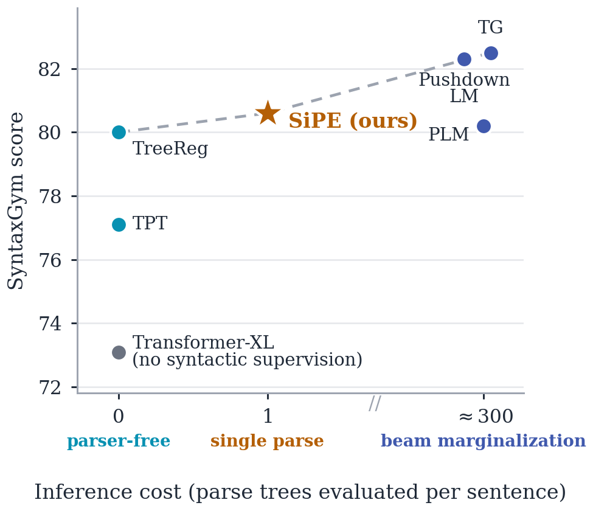
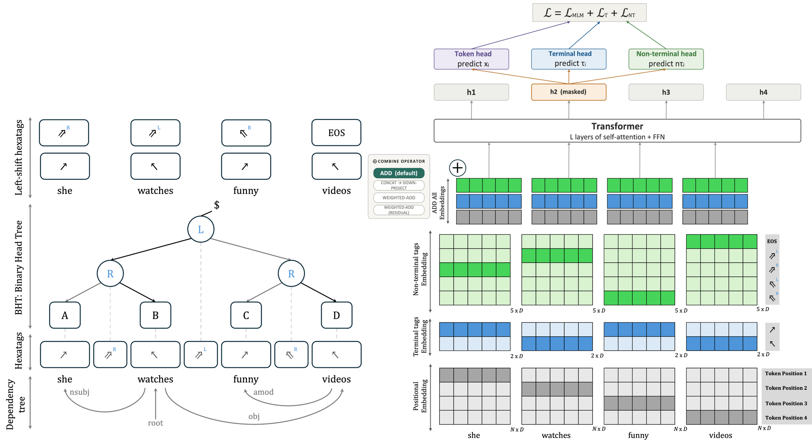

<!-- Logo (disabled for now):
<p align="center">
  
</p>
-->

<h1 align="center">Beyond Sequence Order:<br>Syntax-Informed Positional Embeddings for Transformers</h1>

<p align="center">
  <a href="https://hriaz17.github.io/SiPE/"></a>
  <a href="https://arxiv.org/abs/2608.06111"></a>
  
</p>

<p align="center">
  <a href="https://hriaz17.github.io/">Haris Riaz</a> ·
  Hyungji Kim ·
  <a href="https://surdeanu.cs.arizona.edu/mihai/">Mihai Surdeanu</a>
  <br>
  <br>
  <em>Computational Language Understanding (CLU) Lab, </em> University of Arizona
</p>

---

## Abstract

> Positional embeddings (PE) in Transformers encode token distance and order but are largely agnostic to *syntactic structure*. We introduce **S**yntax-**i**nformed **P**ositional **E**mbeddings (**SiPE**), which learns a lightweight syntactic prior from dependency parses during pretraining and injects it across all three dominant PE families (absolute, relative, rotary), for both encoders and decoders, leaving self-attention and the rest of the architecture untouched. We isolate *where* and *how* the prior should enter the model, and find it depends on the architecture: for autoregressive decoders that use relative PE, the prior is strongest when coupled multiplicatively with the relative-position term of the attention score, outperforming injection into the input embeddings, into self-attention, or into the positional and attention terms jointly — while for encoders it is best added directly to the input embeddings, composing with each encoder's native positional mechanism. We find that models pre-trained with SiPE improve on the SyntaxGym benchmark by up to 10.3% while simultaneously reducing perplexity by 9.0% over a base model with no syntactic supervision — a metric nearly every existing syntax-injection method instead degrades. Crucially, these gains extend beyond syntactic generalization: SiPE also improves real-world language understanding, raising scores on the GLUE benchmark by up to 8.2% over a model trained without it. Unlike existing syntactic language models that marginalize over many parses at inference or discard syntax at runtime, SiPE conditions on a single parse, establishing a new Pareto frontier between syntactic supervision and inference cost.

<p align="center">
  
</p>

## Approach

<p align="center">
  
</p>

**Overview of the approach.** Every sequence the model sees — during pretraining, fine-tuning, and inference — is first hexatagged by a fast dependency parser. **Left:** the dependency parse is converted to a *binary head tree* (BHT) and read off as per-word **hexatags**: a terminal tag τ (2 values, the word's attachment direction) and a non-terminal tag ν (4 values from the BHT, plus an EOS tag introduced by the left shift). **Right:** the simplest injection, for absolute positional embeddings — each word's first subword adds one row from each tiny tag table (**E**<sup>τ</sup>: 2×D, **E**<sup>ν</sup>: 5×D, ~7·D parameters in total) to its input embedding, and three prediction heads recover the token and both tags at masked positions (`L = L_MLM + L_T + L_NT`). For decoders, next-token prediction replaces MLM. For relative-PE decoders, the strongest variant instead **multiplies** the position term of the attention score by a syntax alignment: `Ã = AC + (1 + c)·BD`.

## Code

> 🚧 **Code, hexatagged training data, and pretrained checkpoints will be released upon acceptance.**

## Citation

```bibtex
@misc{riaz2026sequenceordersyntaxinformedpositional,
      title={Beyond Sequence Order: Syntax-Informed Positional Embeddings for Transformers},
      author={Haris Riaz and Hyungji Kim and Mihai Surdeanu},
      year={2026},
      eprint={2608.06111},
      archivePrefix={arXiv},
      primaryClass={cs.CL},
      url={https://arxiv.org/abs/2608.06111},
}
```
